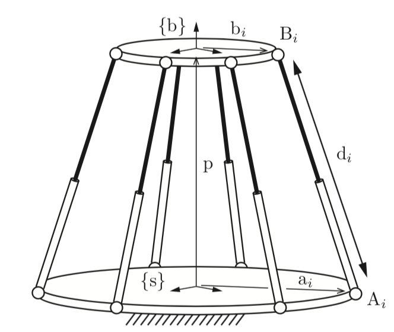

<button type="button" onclick="window.location.href='index.html';">Homepage</button>
<button type="button" onclick="window.location.href='ch6.html';">Previous</button>
<button type="button" onclick="window.location.href='ch8.html';">Next</button>

## Introduction

> Any kinematic chain that contains one or more loops is called a **closed chain**.

> ... **parallel mechanisms**: closed chains consisting of fixed and moving platforms connected by a set of "legs". The legs themselves are typically open chains but sometimes can also be other closed chains.

Here are several notes about closed chains:
* Not all joints in closed chains are actuated, these passive joints make kinematic analysis of closed chains more complicated than open chains.
* Joint variables in closed chains "must satisfy a number of loop closure constraint equations, which may or may not be independent depending on the configuration of the mechanism". This feature introduces the mechanism named redundantly actuated.

A comparision between open-chain robot and parallel robot is given below:

| open-chain robot | parallel robot |
| --- | --- |
| all joints actuated | some joints unactuated |
| large workspace | small workspace |
| weak, flexible | strong, stiff |
| FK straightforward | FK tricky |
| IK tricky | IK(often) straightforward |

Given the complexity of configurations of closed chains, "oftentimes the analysis of these robots is based on symmetries and insight into the specific structure of the mechanism". Thus, this chapter is example-based.

## 3$\times$RPR Planar Parallel Mechanism

For this mechanism, only the forward and inverse kinematics are analyzed. The analysis of inverse kinematics can be easily solved by simple geometry. For forward kinematics, after some algebraic manipulation, the problem can be considered as finding solutions for a single polynomial, behind which is the idea of reducing the complexity of equations exploiting certain features of the mechanism.

Another similar mechanism, the 3$\times$RRR mechanism, is introduced at *Exercise 7.3* in the textbook.

## Stewart-Gouph Platform

### Forward and Inverse Kinematics

This platform is a 6$\times$SPS mechanism, only the six middle prismatic joints are actuated. Similar with the previous example, the inverse kinematics is straightforward using simple geometry knowledge. Again, when meeting forward kinematics problem, the equations can be complicated and hard to solve. In this case, we need to solve 12 unknowns with 12 equations.

### Differential Kinematics

In principle, we can directly differentiate forward kinematics to get:

$$
\dot{s} = G(R, p)\mathcal{V}_s
$$

where $s$ indicates lengths of the prismatic joints, $\mathcal{V}_s$ is the spatial twist of the end-effector, and $G(R,p)$ is the Jacobian of inverse kinematics. But this method usually require considerable algebraic manipulation.

An alternative way is "based on the conversation of power principle used to determine the static relationship $\tau = J^T\mathcal{F}$, which is applicable for both open and closed chains. With this method, the Jacobian matrix can be obtained directly.

## General Parallel Mechanisms

### Forward and Inverse Kinematics

The example general parallel mechanism is shown below:

